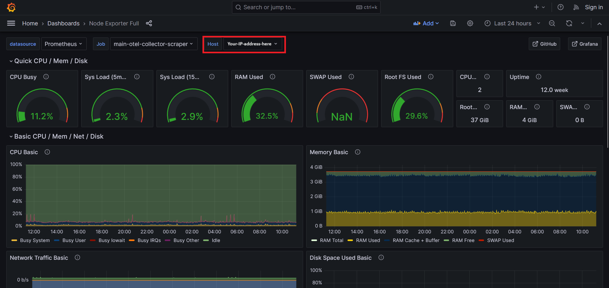

# Client Monitoring

## Overview

This repository provides a monitoring setup for client environments, enabling the collection and visualization of system metrics. The setup is designed to be easily integrated into Jenkins pipelines and can be deployed across multiple virtual machines (VMs) to ensure comprehensive monitoring.

## Setup Instructions

### 1. Copy Files to Your Repository

Copy the files located inside the `client` folder of this repository to the corresponding location in your repository.

### 2. Update Configuration

Update the `<your-ip>` placeholder in the `client/configs/otel-collector-config` file with your actual IP address. This ensures that the OpenTelemetry Collector is correctly configured to send data to the appropriate server.

### 3. Start the Monitoring Containers

To test the monitoring setup, navigate to the directory containing the `docker-compose-client-monitor.yml` file and execute the following command:

```bash
docker-compose -f docker-compose-client-monitor.yml up -d
```

This command will start the monitoring containers in detached mode on the client server.

### 4. Access the Grafana Dashboard

After running the command, you can access the Grafana dashboard to verify that your host appears in the list of monitored hosts. The dashboard can be accessed at:

- **Grafana Dashboard:** [http://5.75.190.25:3000/d/rYdddlPWk/node-exporter-full?orgId=1](http://5.75.190.25:3000/d/rYdddlPWk/node-exporter-full?orgId=1)



If your setup is correct, your host should be listed, and you should see various metrics and visualizations related to your system's performance.

### 5. Jenkins Pipeline Integration

To incorporate the monitoring setup into your Jenkins pipeline, add the command to start the monitoring containers within your `Jenkinsfile`. The pipeline is designed to prompt the user to choose whether to run the monitoring setup on just the monitoring server, the client server, or both.

#### Jenkinsfile Workflow:

- **Prompt for Server Selection:** Upon starting the job, the pipeline will prompt the user to select whether to run the setup on the monitoring server, the client servers, or both.
  
- **Update and Clean Up:** The pipeline will delete everything in the `iProlepsisMonitoring` folders on all servers it touches and update them with the latest content from the GitHub repository.

- **Critical Component Verification:** Depending on the selected server type(s), the pipeline will verify the installation of critical components on the servers before proceeding with the setup.

- **Docker Compose Execution:**
  - **Client Servers:** The pipeline will execute the `iProlepsisMonitoring/client/docker-compose-client-monitor.yml` to start the necessary containers for client monitoring.
  - **Monitoring Server:** The pipeline will execute the `iProlepsisMonitoring/docker-compose.yml` to start the full monitoring stack on the monitoring server.

- **Report Generation:** On the monitoring server, the pipeline will generate a report immediately after execution. Additionally, it will set up a recurring task to generate a new, timestamped report every 3 months. A new report for the previous 3 months can be generated at any time by manually running the `generate_report.py` script.

### 6. Monitoring and Accessing Additional Resources

- **Prometheus Node Exporter:** 
  - Access the Prometheus Node Exporter dashboard at: [http://5.75.190.25:9100/](http://5.75.190.25:9100/)

- **cAdvisor Dashboard:** 
  - Access the cAdvisor dashboard for container monitoring at: [http://5.75.190.25:8080/containers/](http://5.75.190.25:8080/containers/)

### 7. Important Notes

- **Monitoring for Each VM:** The steps outlined above must be followed for each individual VM that needs to be monitored. Each VM will then send its metrics to the central monitoring server.
  
- **Data Storage:** The Grafana dashboard will display and store metrics and visualizations for all monitored hosts. This data will be automatically monitored and stored on the server, allowing for later analysis and reporting.


